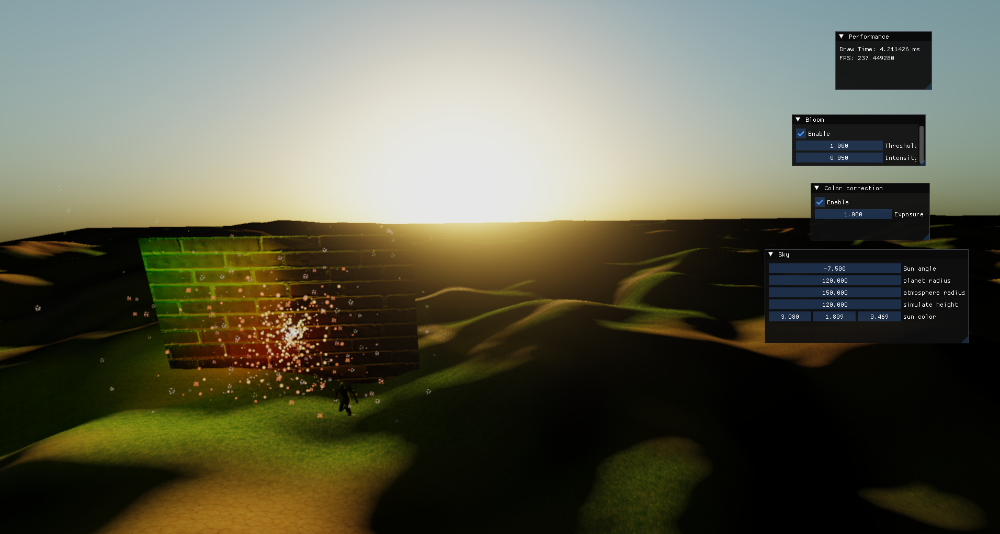

# CGFinalProject - 簡單的渲染引擎

 
    

使用 OpenGL Render API

## 實作功能

 - 使用Deferred render pipeline進行場景渲染
 - 實作骨骼動畫
 - 使用Tessellation shader渲染地形(Terrain)
 - Normal Mapping 材質實作
 - Bloom effect post processing effect
 - Color correction post processing effect

## 建置方式

generate project by using generateProject.bat to generate Visual Studio 2022 project

## 3rd Party
 - Assimp
 - entt
 - glfw
 - imgui
 - spdlog